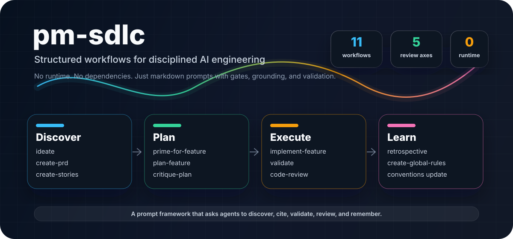

<div align="center">

# pm-sdlc

**Turn AI coding assistants into disciplined engineering partners.**



<p>
  <kbd>11 workflows</kbd>
  <kbd>markdown only</kbd>
  <kbd>zero runtime dependencies</kbd>
  <kbd>Claude Code</kbd>
  <kbd>Antigravity</kbd>
  <kbd>OpenAI Codex</kbd>
</p>

<p>
  <a href="#quick-start"><strong>Quick Start</strong></a> ·
  <a href="#workflow-chain"><strong>Workflow Chain</strong></a> ·
  <a href="#what-makes-this-different"><strong>Why It Works</strong></a> ·
  <a href="#documentation"><strong>Docs</strong></a>
</p>

</div>

> AI coding agents are fast. pm-sdlc makes them accountable.

pm-sdlc is an AI-powered SDLC framework: a set of structured markdown workflows that guide AI assistants from fuzzy idea to reviewed, validated implementation. There is no runtime, no package install, no build step. The workflows are plain markdown files with explicit gates, codebase-grounding rules, and anti-sycophancy constraints.

<table>
  <tr>
    <td width="33%">
      <h3>Grounded in the real codebase</h3>
      <p>Plans require <code>file:line</code> citations from actual source files, so assistants follow your architecture instead of inventing patterns.</p>
    </td>
    <td width="33%">
      <h3>Designed to push back</h3>
      <p>Workflows include critique phases, rationalization scanners, and explicit permission to challenge weak assumptions with specificity.</p>
    </td>
    <td width="33%">
      <h3>Validation is part of the work</h3>
      <p>Implementation, validation, and review workflows force type checks, tests, and concrete evidence before the agent can call work done.</p>
    </td>
  </tr>
</table>

## Quick Start

Clone once, then install the workflows into any project:

```bash
git clone https://github.com/hiteshdundi01/pm-sdlc.git
cd pm-sdlc

# Interactive installer: choose Claude Code, Antigravity, Codex, or all.
./install.sh /path/to/your/project
```

Skip the prompt when you already know the target tool:

```bash
./install.sh /path/to/your/project --tool codex
./install.sh /path/to/your/project --tool claude-code
./install.sh /path/to/your/project --tool antigravity
./install.sh /path/to/your/project --tool all
```

| Tool | Installs To | How You Use It |
| ---- | ----------- | -------------- |
| Claude Code | `.claude/commands/` + `.claude/reference/` | Slash commands such as `/ideate`, `/plan-feature`, `/code-review` |
| Antigravity | `.gemini/antigravity/skills/` | Auto-discovered skills, one workflow per skill directory |
| OpenAI Codex | `.agents/workflows/` + `.agents/reference/` | Reference workflows from `AGENTS.md` or attach them as task context |

<details>
<summary><strong>Manual setup commands</strong></summary>

### Claude Code

```bash
mkdir -p .claude/commands .claude/reference

for f in /path/to/pm-sdlc/workflows/*.md; do
  [ "$(basename "$f")" = "README.md" ] && continue
  cp "$f" .claude/commands/
done

cp /path/to/pm-sdlc/reference/*.md .claude/reference/
echo '.agents/' >> .gitignore
```

### Antigravity

```bash
SKILL_DIR=".gemini/antigravity/skills"

for f in /path/to/pm-sdlc/workflows/*.md; do
  name=$(basename "$f" .md)
  [ "$name" = "README" ] && continue
  mkdir -p "$SKILL_DIR/$name"
  cp "$f" "$SKILL_DIR/$name/SKILL.md"
done

mkdir -p "$SKILL_DIR/ideate/resources"
cp /path/to/pm-sdlc/reference/frameworks.md "$SKILL_DIR/ideate/resources/"
cp /path/to/pm-sdlc/reference/refinement-criteria.md "$SKILL_DIR/ideate/resources/"
cp /path/to/pm-sdlc/reference/examples.md "$SKILL_DIR/ideate/resources/"

mkdir -p "$SKILL_DIR/code-review/resources"
cp /path/to/pm-sdlc/reference/review-standards.md "$SKILL_DIR/code-review/resources/"

echo '.agents/' >> .gitignore
```

### OpenAI Codex

```bash
mkdir -p .agents/workflows .agents/reference

for f in /path/to/pm-sdlc/workflows/*.md; do
  [ "$(basename "$f")" = "README.md" ] && continue
  cp "$f" .agents/workflows/
done

cp /path/to/pm-sdlc/reference/*.md .agents/reference/
cp /path/to/pm-sdlc/AGENTS.md ./

cat >> .gitignore <<'EOF'
.agents/plans/
.agents/reviews/
.agents/stories/
.agents/ideas/
.agents/PRDs/
.agents/reports/
.agents/retros/
.agents/rules/
EOF
```

</details>

## Workflow Chain

Use the workflows in sequence when you want a complete development lifecycle. Each output becomes the next workflow's input.

```mermaid
flowchart LR
    subgraph discovery["Discovery"]
        ideate["ideate"]
        prd["create-prd"]
        stories["create-stories"]
        ideate --> prd --> stories
    end

    subgraph planning["Planning"]
        prime["prime-for-feature"]
        plan["plan-feature"]
        critique["critique-plan"]
        prime --> plan
        plan <--> critique
    end

    subgraph execution["Execution"]
        implement["implement-feature"]
        validate["validate"]
        review["code-review"]
        implement --> validate --> review
    end

    subgraph learning["Learning"]
        retro["retrospective"]
    end

    stories --> prime
    critique --> implement
    review --> retro

    rules["create-global-rules<br/>standalone bootstrap"]

    classDef discover fill:#e0f2fe,stroke:#0284c7,color:#082f49
    classDef planClass fill:#dcfce7,stroke:#16a34a,color:#052e16
    classDef execute fill:#fef3c7,stroke:#d97706,color:#451a03
    classDef learn fill:#fce7f3,stroke:#db2777,color:#500724
    classDef standalone fill:#e5e7eb,stroke:#64748b,color:#111827

    class ideate,prd,stories discover
    class prime,plan,critique planClass
    class implement,validate,review execute
    class retro learn
    class rules standalone
```



`create-global-rules` runs standalone to bootstrap project conventions from an existing codebase.

## Workflow Command Center

| Phase | Workflow | Produces | Built-In Guardrail |
| ----- | -------- | -------- | ------------------ |
| Discover | `ideate` | `.agents/ideas/*.idea.md` | Divergent/convergent thinking, SCAMPER, HMW, JTBD, explicit "Not Doing" list |
| Discover | `create-prd` | `.agents/PRDs/*.prd.md` | 15-section product spec with concrete implementation phases |
| Discover | `create-stories` | `.agents/stories/*.md` and optional Jira issues | Human confirmation before creating Jira work |
| Plan | `prime-for-feature` | Loaded project and task context | Reconciles Jira acceptance criteria against PRD context |
| Plan | `plan-feature` | `.agents/plans/*.plan.md` | Every pattern reference requires a real `file:line` citation |
| Plan | `critique-plan` | `.agents/reviews/plan-reviews/*.review.md` | Scope, YAGNI, sequencing, and rationalization audit |
| Execute | `implement-feature` | Code changes + `.agents/reports/*.md` | Validation after each task and final E2E verification gate |
| Execute | `validate` | Structured pass/fail report | Auto-detects project toolchain and reports exact failures |
| Execute | `code-review` | `.agents/reviews/*.md` | 5-axis read-only review from an isolated git worktree |
| Learn | `retrospective` | `.agents/retros/*.md` + convention updates | Requires at least one concrete lesson or convention update |
| Bootstrap | `create-global-rules` | `AGENTS.md` | Discover-first rules from actual code, not assumptions |

## What Makes This Different

### Anti-Sycophancy by Design

Most AI workflows drift toward polite agreement. pm-sdlc makes challenge a first-class behavior:

- `critique-plan` flags rationalizations like "for testability" and asks for the actual test.
- `code-review` uses severity levels and a 5-axis review model instead of broad "LGTM" commentary.
- `ideate` explicitly asks the agent to push back on weak ideas with specificity and kindness.

### Codebase Grounding

Plans are not generic task lists. They are anchored in the project in front of the agent:

```markdown
### Patterns to Follow

#### Error Handling

SOURCE: src/services/client-service.ts:45-52

Use the existing service-layer error wrapper and sanitized logging pattern
before introducing new database calls.
```

Every pattern reference in a plan must include a `file:line` citation from the actual codebase. No invented conventions, no vibes dressed up as architecture.

### Validation Gates

The workflows do not trust that things work. They ask for proof:

- `implement-feature` runs validation after every implementation task.
- `validate` reports lint, type-check, and test results in a structured pass/fail format.
- `code-review` reviews from an isolated git worktree so the review cannot contaminate your local changes.
- `retrospective` feeds lessons back into conventions so the next feature starts smarter.

## Reference Documents

Workflows load focused reference docs only when they need domain-specific guidance.

| Document | Loaded By | Purpose |
| -------- | --------- | ------- |
| [`frameworks.md`](reference/frameworks.md) | `ideate` | 7 ideation frameworks: SCAMPER, HMW, First Principles, JTBD, Constraint-Based, Pre-mortem, Analogous Inspiration |
| [`refinement-criteria.md`](reference/refinement-criteria.md) | `ideate` | Evaluation rubric for user value, feasibility, differentiation, and assumption audits |
| [`examples.md`](reference/examples.md) | `ideate` | Real ideation examples with analysis of what made them effective |
| [`review-standards.md`](reference/review-standards.md) | `code-review` | 5-axis review framework, severity conventions, and rationalization anti-patterns |
| [`tool-capabilities.md`](reference/tool-capabilities.md) | Tool setup and workflow authors | Maps capability language to Claude Code, Antigravity, and Codex APIs |

## Jira Integration

Jira-aware workflows use Atlassian MCP when it is configured:

| Workflow | Jira Behavior |
| -------- | ------------- |
| `create-stories` | Creates issues, sets priority and labels, links to epics, and adds dependency links after user confirmation |
| `prime-for-feature` | Fetches issues and reconciles acceptance criteria against PRD context |
| `implement-feature` | Transitions issues and adds implementation comments |

Requires the [Atlassian MCP server](https://www.npmjs.com/package/@anthropic/atlassian-mcp-server) to be configured.

## Examples

The [`examples/`](examples/) directory contains realistic workflow outputs:

| Example | Workflow | What It Shows |
| ------- | -------- | ------------- |
| [Ideation Session](examples/ideation-session.md) | `ideate` | HMW framing, variations, stress testing, and a "Not Doing" list |
| [Implementation Plan](examples/implementation-plan.md) | `plan-feature` | `file:line` citations, pattern table, ordered tasks |
| [Plan Critique](examples/plan-critique.md) | `critique-plan` | 7-axis audit, minimum-viable diff, CUT/CHANGE/ADD |
| [Code Review](examples/code-review-report.md) | `code-review` | 5-axis review, plan conformance, validation results |

## Documentation

| Document | Purpose |
| -------- | ------- |
| [Workflow Guide](docs/workflow-guide.md) | How each workflow connects: inputs, outputs, and handoffs |
| [Best Practices](docs/best-practices.md) | Tips, common pitfalls, and effectiveness metrics |
| [FAQ](docs/faq.md) | Common questions about installation, usage, and troubleshooting |

## Project Structure

```text
pm-sdlc/
├── workflows/              # 11 canonical workflow definitions
├── reference/              # Supporting docs loaded by workflows
├── setup/                  # Per-tool installation guides
├── examples/               # Real workflow output examples
├── docs/                   # Extended documentation and README assets
│   └── assets/
├── scripts/                # CI scripts
│   └── check-workflows.sh
├── install.sh              # One-command setup for any project
├── AGENTS.md               # Codex and generic AI-agent instructions
├── CLAUDE.md               # Claude Code project rules
├── CODEBASE-GUIDE.md       # Architecture guide for contributors
├── CONTRIBUTING.md         # Contribution guide
└── LICENSE                 # MIT
```

## Contributing

See [CONTRIBUTING.md](CONTRIBUTING.md). The short version:

1. Fork and branch from `main`
2. Follow the [workflow file conventions](CONTRIBUTING.md#workflow-file-structure)
3. Test workflow changes against a real codebase
4. Open a PR with a clear description

## License

MIT. See [LICENSE](LICENSE).
